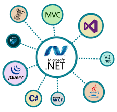
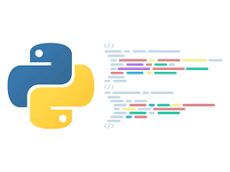

### Hi there 👋 Hey is a snap shot of my skillset. Read my bio for more!
<table>
  <tr>
    <td width="200px">
      
    </td>
    <td width="250px">
      
    </td>
    <td width="250px">
      
    </td>
  </tr>
</table> 

- I have been programming all my life, started with Java and C++, but grew into other langauges. My stong suites is .NET C# with
  other .NET frameworks and languages like ASP.net, F# and VB.net. Node is my favorite quick setup of an API server or desktop
  app with electron. Connecting mongoDB, use bootstrap/jquery or angualar for a frontend and a nodeJS Backend all in docker... 
  now thats fun! 
 
<table>
  <td width="250px">
    
  </td>
</table>

<!--
**sovr610/sovr610** is a ✨ _special_ ✨ repository because its `README.md` (this file) appears on your GitHub profile.

Here are some ideas to get you started:

- 🔭 I’m currently working on ...
- 🌱 I’m currently learning ...
- 👯 I’m looking to collaborate on ...
- 🤔 I’m looking for help with ...
- 💬 Ask me about ...
- 📫 How to reach me: ...
- 😄 Pronouns: ...
- ⚡ Fun fact: ...
-->
